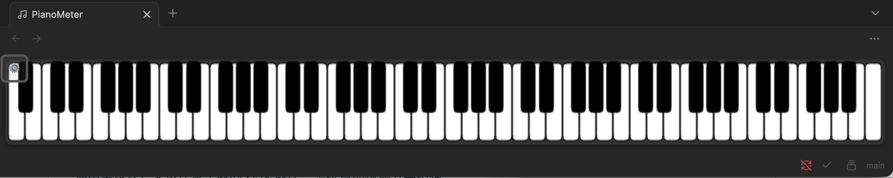

# Obsidian PianoMeter

88 键钢琴键盘显示器，在 Obsidian 中实时显示 MIDI 输入和和弦识别。

基于 [NiceChord 好和弦](https://nicechord.com/) 的 [PianoMeter](https://github.com/wiwikuan/pianometer) 项目。



---

## 功能特性

- **88 键钢琴键盘**：完整的钢琴键盘可视化显示
- **MIDI 输入**：连接 MIDI 键盘实时显示按键
- **和弦识别**：自动识别并显示当前演奏的和弦名称
- **踏板显示**：显示延音踏板状态
- **深色/浅色模式**：自动适应 Obsidian 主题

---

## 安装

### 手动安装

1. 下载最新 Release 中的 `main.js`、`manifest.json`、`styles.css`
2. 在 Obsidian vault 中创建目录：`.obsidian/plugins/pianometer/`
3. 将下载的文件复制到该目录
4. 重启 Obsidian
5. 在设置 → 第三方插件中启用 PianoMeter

### 从源码构建

```bash
# 克隆仓库
git clone https://github.com/chaye7417/obsidian-pianometer.git
cd obsidian-pianometer

# 安装依赖
npm install

# 构建
npm run build

# 将 main.js, manifest.json, styles.css 复制到插件目录
```

---

## 使用方法

1. 启用插件后，使用命令面板（Cmd/Ctrl + P）
2. 搜索 "PianoMeter" 或 "钢琴"
3. 选择 "打开 PianoMeter" 命令
4. 连接 MIDI 键盘开始使用

---

## 依赖

- [Tonal](https://github.com/tonaljs/tonal) - 音乐理论库，用于和弦识别

---

## 致谢

- [NiceChord 好和弦](https://nicechord.com/) - 原始 PianoMeter 项目
- [wiwikuan](https://github.com/wiwikuan/pianometer) - Obsidian 版本原作者

---

## 许可证

MIT License
